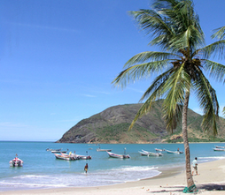

Island Trend
============

Replaces the "TRENDING" section of Facebook with an island.

I don't like the "TRENDING" section in the corner of Facebook.
I don't want to hear about the affairs of D-list celebrities or
who won a competition I'll never watch. I want to see a little
tropical island instead.

_To install:_

- Download the contents of this repo (click the button at the top that says "ZIP").
- Open the Extensions view in Chrome.
- Make sure Developer mode is enabled.
- Click "Load unpacked extension...".
- Point the file dialog to wherever you downloaded the ZIP.
- Enjoy?

_To update:_

- Re-download the ZIP and extract it to the same place as before. (Or just `$ git pull`.)
- Open the Extensions view in Chrome.
- Find the "Island Trend" extension and click the link that says "Reload".
- Accept my gratitude for using my dumb thing.
